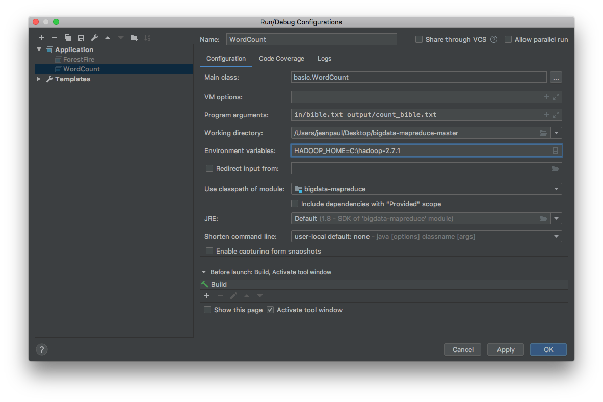

**Tutorial de instalação: MapReduce para Windows**

Fazer uma cópia da pasta hadoop-2.7.1 disponível neste repositório.
Mover esta pasta para um local desejado.

Assume-se para este exemplo a seguinte pasta:
> C:\\hadoop-2.7.1

Definir o path do `HADOOP_HOME` como uma variável de ambiente. Isto é:
> HADOOP_HOME=C:\\hadoop-2.7.1

Concatenar ao `PATH` o `HADOOP_HOME`, assim como a sua pasta bin. Isto é:
> HADOOP\_HOME

e

> HADOOP\_HOME\\bin

<!--Opção 1. Definir essa variável de ambiente no sistema operacional. [Esse link](https://www.youtube.com/watch?v=uGiMRWuwGng) pode auxiliar.

Opção 2. No IntelliJ, ir na configuração demonstrada abaixo e definir o `HADOOP_HOME` para cada execução do projeto.

-->